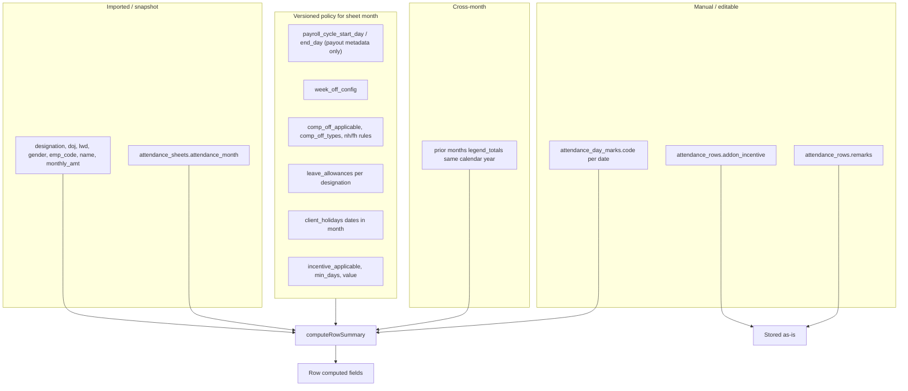
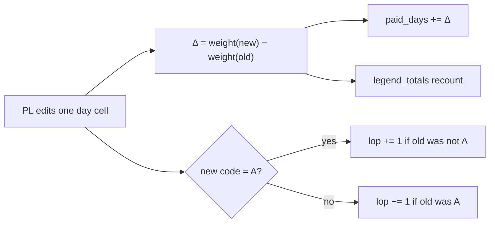

# Attendance Calculation Dependency Fields

Reference for HR/PL testing and engineering. Source of truth: [`backend/src/utils/attendanceCalculator.js`](../backend/src/utils/attendanceCalculator.js), orchestrated by [`backend/src/utils/attendanceRecalc.js`](../backend/src/utils/attendanceRecalc.js).

---

## 1. Input layers

**Policy version rule:** For sheet month `M`, the system uses the newest `client_policy_versions` row where `effective_from_month <= M`. See [`fetchClientPolicyBundleForMonth`](../backend/src/utils/clientPolicy.js).

---

## 2. Calculation window (foundation for all day-based math)

All calculations cover the sheet's **calendar month** (1st → last day of `attendance_month`), matching the day columns shown in the attendance grid. The payroll cycle (`payroll_cycle_start_day` / `payroll_cycle_end_day`) is retained as **payout metadata only** (sheet header display) and does not affect any computed value.

| Derived | Depends on |
|---------|------------|
| `calc_period.start` / `calc_period.end` | Sheet `attendance_month` (1st → last calendar day) via `getCalendarMonthPeriod` |
| `periodDates[]` | All calendar dates from start → end (inclusive) |
| Default `W` / `NH` suggestions | `week_off_config`, `holidays` in the month, empty cells only |

Marks stored outside the sheet's calendar month are ignored by the calculation.

---

## 3. Computed row fields — dependency matrix

### A. Day-level inputs (primary driver)

| Output field | Direct dependencies |
|--------------|---------------------|
| **`legend_totals`** | Count of each code in `day_marks` within the calendar month only (`P`, `W`, `NH`, `FH`, `P-NH`, `P-FH`, `HD`, `EL`, `SL`, `CL`, `PL`, `ML`, `RH`, `CO`, `A`, `R`, `T`, `-`) |
| **`paid_days`** | **Sum of per-day paid weights** across active employment days in the calendar month. Each cell edit changes `paid_days` by `newWeight − oldWeight` for that date (see Section 3A.1). Empty cell weight = 0. |
| **`lop`** | Count of `A` on active employment days |
| **`not_considered`** | Days before `doj` or after `lwd`; codes `R`, `T`, `-` on active days |
| **`total_days`** | Count of active employment days in the calendar month |

#### Paid-day weight by code

| Code | Weight | Policy overrides |
|------|--------|------------------|
| `P`, `W`, `NH`, `FH`, `EL`, `SL`, `CL`, `PL`, `ML`, `RH`, `CO` | 1.0 | — |
| `HD` | 0.5 | — |
| `A` | 0 (counts as LOP) | — |
| `P-NH` | 1.0 default | `paid_comp_off_rule` if PAID_CO; else `nh_pay_rule` if NH comp-off on |
| `P-FH` | 1.0 default | `paid_comp_off_rule` if PAID_CO; else `fh_pay_rule` if FH comp-off on |
| `R`, `T`, `-` | 0 (not considered) | — |
| Empty | 0 | — |

Employee active check uses **`doj`** and **`lwd`** on each calendar date in the period.

#### 3A.1 Paid Days — Payroll Lead edit-impact view

`paid_days` is **not** a single formula field — it is the running total of daily weights. When PL/PM changes one cell and auto-save runs, **paid_days moves by the delta** between the old code’s weight and the new code’s weight on that date.

**Core rule:** `Δ paid_days = weight(newCode) − weight(oldCode)` (only on active employment dates).

| PL changes cell from → to | Δ paid_days | Also affects |
|---------------------------|-------------|--------------|
| Empty → `HD` | **+0.5** | `legend_totals.HD +1` |
| `P` → `HD` | **−0.5** | `legend_totals.P −1`, `HD +1` |
| `HD` → `P` | **+0.5** | `legend_totals.HD −1`, `P +1` |
| `HD` → Empty | **−0.5** | `legend_totals.HD −1` |
| Empty → `NH` | **+1.0** | `legend_totals.NH +1`, `NH_taken` / `NH_left` |
| `P` → `NH` | **0** (both weight 1.0) | `legend_totals` only (`P −1`, `NH +1`) |
| `NH` → `A` | **−1.0** | `lop +1`, `legend_totals.NH −1`, `A +1` |
| `NH` → Empty | **−1.0** | `legend_totals.NH −1`, `NH_taken` / `NH_left` |
| Empty → `P` | **+1.0** | `legend_totals.P +1` |
| `P` → `A` | **−1.0** | `lop +1`, `legend_totals` swap |
| `W` → `HD` | **−0.5** | Both are paid; `W` and `HD` legend counts shift |
| Empty → `P-NH` | **+1.0** (default) | May use `nh_pay_rule` / `paid_comp_off_rule` if comp-off policy on |
| `P-NH` → `A` | **−weight(P-NH)** | Policy-dependent weight |

**HD (Half day):** Always contributes **0.5** to paid days. PL expectation: every HD cell in the period adds half a paid day; removing or changing HD subtracts 0.5.

**NH (National Holiday):** Contributes **1.0** full paid day (same as `P`, `W`, leave codes). PL expectation: marking a day `NH` adds 1 paid day; clearing or changing away from `NH` subtracts 1. NH also affects **leave summary** (`NH_taken`, `NH_left`) because NH quota is tracked per period.

**Important PL distinctions:**

- `NH` vs `P-NH`: `NH` = employee on holiday (1 paid day). `P-NH` = worked on holiday (paid weight may follow comp-off pay rules; also affects CO earned and incentive streak).
- `W` (week off) = 1 paid day — changing `W` ↔ `HD` changes paid days by ±0.5.
- Empty cell = **0** paid weight — PL marking a day for the first time always **adds** that code’s weight.

**Auto-save behavior:** After edit, server recomputes the full row — PL should see `paid_days` update within ~400ms reflecting the delta above (not a manual recalc).

---

### B. Leave summary (`leave_summary` JSON)

| Output field | Depends on |
|--------------|------------|
| **`EL_taken`, `SL_taken`, `CL_taken`, `PL_taken`, `ML_taken`, `RH_taken`, `CO_taken`** | Prior months YTD (`legend_totals` from earlier sheets) + current period `legend_totals` for that code |
| **`NH_taken`, `FH_taken`** | Current period `legend_totals.NH` / `FH` only (not annual YTD style) |
| **`NH_taken_ytd`, `FH_taken_ytd`** | YTD including current period |
| **`EL_annual`, `SL_annual`, `CL_annual`, `PL_annual`, `ML_annual`** | `leave_allowances` row matching **`designation`** (`earned_days`, `sick_days`, `paid_days`, `paternity_days`, `maternity_days`) |
| **`EL_left`, `SL_left`, `CL_left`, `PL_left`, `ML_left`** | `annual − ytdWithPeriod` for each leave type |
| **`NH_allowed`, `FH_allowed`** | Count of NH/FH holiday dates in the calendar month from **`holidays`** |
| **`NH_left`, `FH_left`** | `allowed − periodTaken` |
| **`CO_earned_period`** | `P-NH count × nh_off_rule` + `P-FH count × fh_off_rule` when comp-off CO enabled |
| **`CO_left`** | `openingCoBalance + CO_earned_period − CO_taken_ytd` (**`openingCoBalance` always 0 today — not wired**) |
| **`RH_left`** | Always `0` (no annual RH allowance in policy) |

**YTD source:** [`fetchYtdTakenByEmployee`](../backend/src/utils/attendanceRecalc.js) sums `legend_totals` from prior sheets where `attendance_month < currentMonth` in the same calendar year.

**Cascade:** Editing month M triggers forward-month recalc for the same employee (M+1 … Dec) so `*_taken` / `*_left` stay consistent.

---

### C. Incentive

| Output field | Depends on |
|--------------|------------|
| **`incentive`** | Longest consecutive calendar streak of `P`, `P-NH`, `P-FH`, `HD` on active days in period; compared to `incentive_min_days`; pays `incentive_value` if `incentive_applicable` |

Streak breaks on: week-off, holiday, leave, absent, empty, `R`/`T`/`-`, or inactive dates.

**Not affected by:** `addon_incentive`, `remarks`, `monthly_amt`.

---

### D. Manual / non-computed fields

| Field | Source | Recalculated? |
|-------|--------|---------------|
| **`addon_incentive`** | PL/PM types manually | No — stored as entered |
| **`remarks`** | PL/PM types manually | No |
| **`monthly_amt`** | CSV import | No |
| Employee snapshot (`name`, `emp_code`, `mobile`, `designation`, `doj`, `lwd`, `gender`, etc.) | CSV import | No — used as inputs to calc |

---

## 4. Default marks (pre-calculation)

Applied on save/upload/recompute via [`suggestDefaultMarks`](../backend/src/utils/attendanceCalculator.js):

| Suggested code | When |
|----------------|------|
| `NH` | Date is in `holidays` and cell is empty |
| `W` | Date matches `week_off_config` and cell is empty |

**Never overwrites** existing manual marks.

---

## 5. What triggers recalculation

| Trigger | Rows affected | Policy used |
|---------|---------------|-------------|
| Inline edit (auto-save) | Changed row + forward YTD months for employee | Version for each sheet month |
| Policy save (Effective from month) | All sheets `>= effective_from_month` | Version per sheet month |
| CSV upload | All rows on sheet | Version for sheet month |
| Manual **Recompute** button | All rows on visible sheet | Version for sheet month |

**Recomputed columns:** `paid_days`, `lop`, `not_considered`, `total_days`, `legend_totals`, `leave_summary`, `incentive`.

---

## 6. UI column → dependency quick map (HR view)

| Grid column | Editable? | Driven by |
|-------------|-----------|-----------|
| Daily cells | Yes | — (input) |
| Legend totals (P, W, EL, …) | No | Day marks |
| Paid Days | No | **Sum of daily weights** — each cell edit adds/subtracts that code’s weight (HD = 0.5, NH/P/W = 1.0, A/empty = 0). See Section 3A.1 |
| LOP | No | `A` count |
| Not Considered | No | DOJ/LWD + R/T/- |
| Leave summary (EL, SL, CL, …) | No | Day marks + allowances + YTD prior months + NH/FH holidays in period |
| Incentives | No | Day marks streak + incentive policy |
| Add-on Incentives | Yes | Manual only |
| Remarks | Yes | Manual only |

---

## 7. Known limitations (for test design)

- **`openingCoBalance`** not implemented — `CO_left` ignores carry-forward from prior year
- **Payroll cycle** (`payroll_cycle_start_day`/`end_day`) is payout metadata only — it no longer affects paid days or any computed field
- **FH holidays** forced to NH in policy storage; FH only via manual marks
- **Gender** affects display only (ML/PL column visibility), not calculation
- **Policy changes** do not retroactively change months before Effective from month (by design)

---

## 8. PL test cases for paid_days edits

Automated in [`backend/scripts/smoke-attendance-paid-days-delta.mjs`](../backend/scripts/smoke-attendance-paid-days-delta.mjs) (`npm run smoke:paid-days`).

| Test | Action | Expected paid_days change |
|------|--------|---------------------------|
| T1 | Mark empty day as `HD` | +0.5 |
| T2 | Change `HD` back to empty | −0.5 |
| T3 | Change `P` to `HD` | −0.5 |
| T4 | Change `HD` to `P` | +0.5 |
| T5 | Mark empty day as `NH` | +1.0 |
| T6 | Change `NH` to `A` | −1.0 paid, +1 LOP |
| T7 | Change `P` to `NH` | 0 paid change; NH legend +1, P legend −1 |
| T8 | Two HD edits same row | +1.0 total (0.5 + 0.5) |

---

## 9. Suggested use

- **HR/PL test scripts:** Use Section 6 to know which cell edit should move which column
- **Regression tests:** Change one input at a time per Section 3 and assert only dependent outputs change
- **Policy change tests:** Vary Effective from month; assert older sheets frozen (Section 5)
- **Related:** Manual QA checklist in [`attendance-qa-checklist.md`](attendance-qa-checklist.md)
